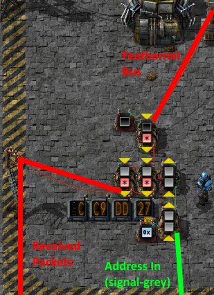
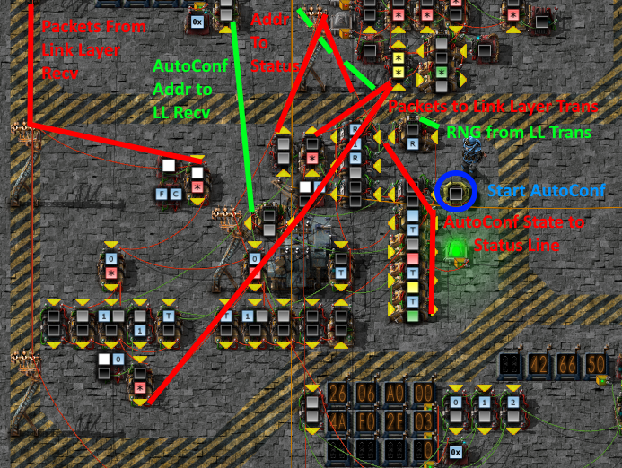
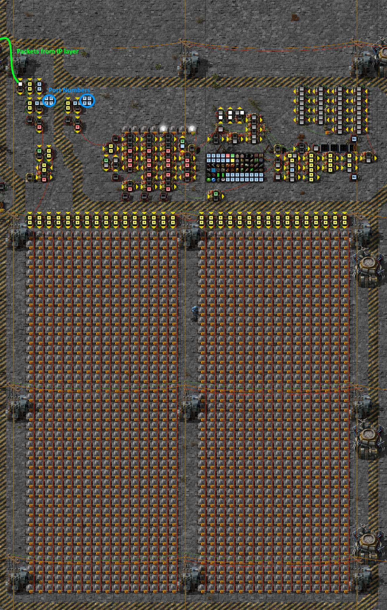


# Feathernet: Autoconfigured Native and IPv6 Networking over Factorio Circuit Networks

Feathernet is a protocol (and implementation) for transmitting packet based data (native Factorio signals, or IP packets) between many nodes over a single shared wire.

## Packet Structure

|  Signal      | Fields                    | Notes       |
|--------------|---------------------------|-------------|
| signal-black | Collision Detection       | always=1    |
| signal-grey  | Destination Address       | 0=Broadcast |
| signal-white | Protocol Type             |             |

The primary Feathernet header is located on `signal-black`, `signal-grey`, and `signal-white`, in order to leave free as many signals as possible for raw-signal mode. Specifically, These were chosen to avoid vanilla color signals and signals used by Signal Strings, allowing transmission of string-based packets. Item and fluid signals were also avoided to allow transmission of logistic network reports or request lists without the need for additional filtering.

Collision detection is achieved by the use of a canary signal on `signal-black`. This signal MUST be set to 1 on all transmitted messages. A receiving node MUST discard any messages received with values other than 1, or report them as errors. 

If a collision is detected while transmitting, the transmitting node MAY retransmit the frame, but it MUST wait a delay period first. This delay MUST vary and SHOULD increase on subsequent retries. 

All nodes MUST listen for packets addressed to the Broadcast address, `0`. In addition, nodes may selectively listen for packets sent to one or more specific addresses. Multiple nodes MAY use the same address, IF the addresses are derived from higher layer addresses longer than 32bits, but the higher layer will receive the packets for each other node sharing a Feathernet address.

To allow higher layer protocols to support varied packet structures (reasonably large byte-stream packets, Signal Strings, and full item lists), multiple framing styles are defined, selected by the Protocol Type field.

| Protocol Type | Protocol               |
|---------------|------------------------|
|             0 | raw signals            |
|             1 | IPv6 on vanilla signals|
|             2 | Feathernet Control     |

## Feathernet Control

Feathernet Control Protocol provides link-layer configuration services, including 

|  Signal      | Fields                    |
|--------------|---------------------------|
| signal-0     | Message Type              |
| signal-1     | Subject Address           |

| Message Type |                           |
|--------------|---------------------------|
| 1            | Neighbor Solicit          |
| 2            | Neighbor Advertise        |

When a node comes up without an address, it MAY select one automatically. To do this, the node takes a random number a candidate address, and broadcasts a Neighbor Solicit for that address. If no node answers within 180 ticks, the node broadcasts a Neighbor Advertise itself. If the node receives a Neighbor Advertise in response to the Solicit, it selects a new candidate address and starts again.

When any node receives a Neighbor Solicit for it's own address, it MUST respond with a Neighbor Advertise.

## IPv6 

IPv6 structure is as described in RFC2460, with an example header here (assuming no options) for reference. Signals are assembled big-endian from bytes on the wires - the first byte to come in off the wire is the highest byte of the signal. The last signal will be filled with 0s in the low bytes if required to make a full 32bit word.

|   signal | Header Fields                  | Notes            |
|----------|--------------------------------|------------------|
| signal-0 | version:trafficclass:flowlabel | const 0x60000000 = 1610612736 |
| signal-1 | payloadlength:nexthead:hoplim  | `nexthead = (signal & 0xff00) >> 8` `payloadlength = (signal >> 16) & 0xffff` |
| signal-2 | source address                 | High             |
| signal-3 | source address                 | Middle High      |
| signal-4 | source address                 | Middle Low       |
| signal-5 | source address                 | Low              |
| signal-6 | destination address            | High             |
| signal-7 | destination address            | Middle High      |
| signal-8 | destination address            | Middle Low       |
| signal-9 | destination address            | Low              |

Nodes MUST configure an address in fe80::/64. Nodes MAY also configure addresses under prefixes advertised on the link by routers, or added via manual configuration.

### ICMPv6

ICMPv6 and NDP are defined in RFC4443 and RFC4861, with example headers provided here (assuming no IPv6 options) for reference.

|  signal  | Fields |
|----------|---------------|
| signal-A | type:code:checksum |
| signal-B | Data |

#### Ping/Pong

|  signal  | Fields |
|----------|---------------|
| signal-A | type:code:checksum |
| signal-B | identifier:sequence |
|   ...    | payload |

#### Route Advertisement

|  signal  | Fields |
|----------|---------------|
| signal-A | type:code:checksum |
| signal-B | hoplim8:flags8:routerlifetime16 |
| signal-C | reachabletime |
| signal-D | retranstime |
| signal-E | options... |
|   ...    | options... |

| offset | Fields |
|--------|------------------|
|    0   | type:length:data |
|    1   | data |
|   ...  | data ... |

Length is in pairs of signals (8 bytes)

  * source link layer
	* type = 1
    * feathernet address is 4 bytes, which gets split across signals
  * prefix information
    * type = 3
    * 0 = type:length:prefixlen8:L1:A1:reserved
    * 1 = valid lifetime : seconds prefix is valid for
    * 2 = preferred lifetime : seconds prefix is preferred for
    * 3 = reserved
    * 4-7 = prefix data
	

### UDP

UDP is defined in RFC768, with an example header provided here (assuming no IPv6 options) for reference.

|  signal  | Fields |
|----------|---------------|
| signal-A | source port : destination port |
| signal-B | length : checksum |
| signal-C | data |
|    ...   | data... |

### Signal order for IPv6 on vanilla signals

In order to provide a mapping from the bytes in a packet to signals, it is neccesary to put the signals in a consistent order. Ideally, only Vanilla signals would be considered for this, for maximum compatibility, but this produces an MTU which is not sufficient for IPv6. The order of Vanilla signals is specified here, and a mod is provided which creates the additional signals required to reach a MTU of 1280 as required by IPv6. Signals beyond the vanilla list are simply `signal-n` where `n` is the index, such as `signal-249`, `signal-250`, `signal-319`. Additionally, blueprints are provided for an implementation of converting an index and value to the given signal and vice versa.

`signal-white`, `signal-grey`, and `signal-black` are left unordered, as these are used by the Feathernet link layer header.

| index | signal |
|-------|--------|
|    0  |signal-0|
|    1  |signal-1|
|    2  |signal-2|
|    3  |signal-3|
|    4  |signal-4|
|    5  |signal-5|
|    6  |signal-6|
|    7  |signal-7|
|    8  |signal-8|
|    9  |signal-9|
|   10  |signal-A|
|   11  |signal-B|
|   12  |signal-C|
|   13  |signal-D|
|   14  |signal-E|
|   15  |signal-F|
|   16  |signal-G|
|   17  |signal-H|
|   18  |signal-I|
|   19  |signal-J|
|   20  |signal-K|
|   21  |signal-L|
|   22  |signal-M|
|   23  |signal-N|
|   24  |signal-O|
|   25  |signal-P|
|   26  |signal-Q|
|   27  |signal-R|
|   28  |signal-S|
|   29  |signal-T|
|   30  |signal-U|
|   31  |signal-V|
|   32  |signal-W|
|   33  |signal-X|
|   34  |signal-Y|
|   35  |signal-Z|
|   36  |signal-red|
|   37  |signal-green|
|   38  |signal-blue|
|   39  |signal-yellow|
|   40  |signal-pink|
|   41  |signal-cyan|
|   42  |water|
|   43  |crude-oil|
|   44  |steam|
|   45  |heavy-oil|
|   46  |light-oil|
|   47  |petroleum-gas|
|   48  |sulfuric-acid|
|   49  |lubricant|
|   50  |wooden-chest|
|   51  |iron-chest|
|   52  |steel-chest|
|   53  |storage-tank|
|   54  |transport-belt|
|   55  |fast-transport-belt|
|   56  |express-transport-belt|
|   57  |underground-belt|
|   58  |fast-underground-belt|
|   59  |express-underground-belt|
|   60  |splitter|
|   61  |fast-splitter|
|   62  |express-splitter|
|   63  |burner-inserter|
|   64  |inserter|
|   65  |long-handed-inserter|
|   66  |fast-inserter|
|   67  |filter-inserter|
|   68  |stack-inserter|
|   69  |stack-filter-inserter|
|   70  |small-electric-pole|
|   71  |medium-electric-pole|
|   72  |big-electric-pole|
|   73  |substation|
|   74  |pipe|
|   75  |pipe-to-ground|
|   76  |pump|
|   77  |rail|
|   78  |train-stop|
|   79  |rail-signal|
|   80  |rail-chain-signal|
|   81  |locomotive|
|   82  |cargo-wagon|
|   83  |fluid-wagon|
|   84  |artillery-wagon|
|   85  |car|
|   86  |tank|
|   87  |logistic-robot|
|   88  |construction-robot|
|   89  |logistic-chest-active-provider|
|   90  |logistic-chest-passive-provider|
|   91  |logistic-chest-storage|
|   92  |logistic-chest-buffer|
|   93  |logistic-chest-requester|
|   94  |roboport|
|   95  |small-lamp|
|   96  |red-wire|
|   97  |green-wire|
|   98  |arithmetic-combinator|
|   99  |decider-combinator|
|  100  |constant-combinator|
|  101  |power-switch|
|  102  |programmable-speaker|
|  103  |stone-brick|
|  104  |concrete|
|  105  |hazard-concrete|
|  106  |landfill|
|  107  |cliff-explosives|
|  108  |iron-axe|
|  109  |steel-axe|
|  110  |repair-pack|
|  111  |blueprint|
|  112  |deconstruction-planner|
|  113  |blueprint-book|
|  114  |boiler|
|  115  |steam-engine|
|  116  |steam-turbine|
|  117  |solar-panel|
|  118  |accumulator|
|  119  |nuclear-reactor|
|  120  |heat-exchanger|
|  121  |heat-pipe|
|  122  |burner-mining-drill|
|  123  |electric-mining-drill|
|  124  |offshore-pump|
|  125  |pumpjack|
|  126  |stone-furnace|
|  127  |steel-furnace|
|  128  |electric-furnace|
|  129  |assembling-machine-1|
|  130  |assembling-machine-2|
|  131  |assembling-machine-3|
|  132  |oil-refinery|
|  133  |chemical-plant|
|  134  |centrifuge|
|  135  |lab|
|  136  |beacon|
|  137  |speed-module|
|  138  |speed-module-2|
|  139  |speed-module-3|
|  140  |effectivity-module|
|  141  |effectivity-module-2|
|  142  |effectivity-module-3|
|  143  |productivity-module|
|  144  |productivity-module-2|
|  145  |productivity-module-3|
|  146  |raw-wood|
|  147  |coal|
|  148  |stone|
|  149  |iron-ore|
|  150  |copper-ore|
|  151  |uranium-ore|
|  152  |raw-fish|
|  153  |wood|
|  154  |iron-plate|
|  155  |copper-plate|
|  156  |solid-fuel|
|  157  |steel-plate|
|  158  |plastic-bar|
|  159  |sulfur|
|  160  |battery|
|  161  |explosives|
|  162  |crude-oil-barrel|
|  163  |heavy-oil-barrel|
|  164  |light-oil-barrel|
|  165  |lubricant-barrel|
|  166  |petroleum-gas-barrel|
|  167  |sulfuric-acid-barrel|
|  168  |water-barrel|
|  169  |copper-cable|
|  170  |iron-stick|
|  171  |iron-gear-wheel|
|  172  |empty-barrel|
|  173  |electronic-circuit|
|  174  |advanced-circuit|
|  175  |processing-unit|
|  176  |engine-unit|
|  177  |electric-engine-unit|
|  178  |flying-robot-frame|
|  179  |satellite|
|  180  |rocket-control-unit|
|  181  |low-density-structure|
|  182  |rocket-fuel|
|  183  |nuclear-fuel|
|  184  |uranium-235|
|  185  |uranium-238|
|  186  |uranium-fuel-cell|
|  187  |used-up-uranium-fuel-cell|
|  188  |science-pack-1|
|  189  |science-pack-2|
|  190  |science-pack-3|
|  191  |military-science-pack|
|  192  |production-science-pack|
|  193  |high-tech-science-pack|
|  194  |space-science-pack|
|  195  |pistol|
|  196  |submachine-gun|
|  197  |shotgun|
|  198  |combat-shotgun|
|  199  |rocket-launcher|
|  200  |flamethrower|
|  201  |land-mine|
|  202  |firearm-magazine|
|  203  |piercing-rounds-magazine|
|  204  |uranium-rounds-magazine|
|  205  |shotgun-shell|
|  206  |piercing-shotgun-shell|
|  207  |cannon-shell|
|  208  |explosive-cannon-shell|
|  209  |uranium-cannon-shell|
|  210  |explosive-uranium-cannon-shell|
|  211  |artillery-shell|
|  212  |rocket|
|  213  |explosive-rocket|
|  214  |atomic-bomb|
|  215  |flamethrower-ammo|
|  216  |grenade|
|  217  |cluster-grenade|
|  218  |poison-capsule|
|  219  |slowdown-capsule|
|  220  |defender-capsule|
|  221  |distractor-capsule|
|  222  |destroyer-capsule|
|  223  |discharge-defense-remote|
|  224  |artillery-targeting-remote|
|  225  |light-armor|
|  226  |heavy-armor|
|  227  |modular-armor|
|  228  |power-armor|
|  229  |power-armor-mk2|
|  230  |solar-panel-equipment|
|  231  |fusion-reactor-equipment|
|  232  |energy-shield-equipment|
|  233  |energy-shield-mk2-equipment|
|  234  |battery-equipment|
|  235  |battery-mk2-equipment|
|  236  |personal-laser-defense-equipment|
|  237  |discharge-defense-equipment|
|  238  |exoskeleton-equipment|
|  239  |personal-roboport-equipment|
|  240  |personal-roboport-mk2-equipment|
|  241  |night-vision-equipment|
|  242  |stone-wall|
|  243  |gate|
|  244  |gun-turret|
|  245  |laser-turret|
|  246  |flamethrower-turret|
|  247  |artillery-turret|
|  248  |radar|
|  249  |rocket-silo|		 

## Implementation 

### Factorio - Feathernet Link Layer
#### Receiver

The Feathernet receiver is simply a filter checking for black=1 and destination equal to broadcast or the node's own address. The current implementation uses a node address of 1 until it is configured. Received packets are sent to higher layer protocols as they come in, with signal-black and signal-grey cleared for working space.

#### Transmitter

The Feathernet Tramsitter manages sending packets out onto the bus. Incoming packets (from higher layer circuits) are queued in a small FIFO memory, and transmitted by the collision-detection state machine. The Transmitter also contains the RNG, which is provided as an output for other modules to use as required. The Status line will have signal-blue set while the Transmitter is holding a packet which has not yet been transmitted.

##### RNG
Various protocols call for random numbers for various purposes. To accomodate this, the Transmitter includes a small LCG, with the parameters used by glibc (a=1103515245, c=12345) and outputting the low 31 bits as signal-R on the transmitter status wire. Due to the nature of combinators, there are three copies of this LCG running in parallel at different phases. When any packet is transmitted, all the signals in the frame are summed and added to the current value at each of the three stages, to accumulate entropy. The RNG cycles continously, and applications needing random numbers simply sample the current value when required.

### Factorio - Protocol Layers

#### FCP

FCP allows nodes to self-configure unique addresses. For non-IP networks, the link layer and FCP modules are sufficient to provide basic networking, using Native Signals framing or other framing specified elsewhere.

Autoconfiguration must be triggered manually once the circuits have been constructed by pressing the Start AutoConf button. The module will then perform FCP autoconfig as described above, and provide the selected address to the receiver. Additionally, the FCP module provides red(unconfigured)/yellow(autoconf in progress)/green(autoconf completed) signals on the status line to indicate address selection state.

#### IPv6

The current IPv6 node supports recieving packets with up to three addresses: The link-local address, formed by fe80::/64 and the 32bit node identifier, The all-nodes broadcast address ff02::1, and a globally routable unicast address, formed by a 64-96bit prefix and the node identifier. Packets matching one of these addresses are forwarded to higher layer protocols, with white=NextHeader and grey=PayloadSize.

|  Signal  | Configuation Value |
|----------|--------------------|
| signal-0 | Prefix             |
| signal-1 | Prefix             |
| signal-2 | Prefix             |
| signal-P | Prefix Length      |
| signal-T | Prefix Valid Time (ticks) |
| signal-R | Router Link-Layer Address |
| signal-H | Hop Limit          |

#### ICMP

The current node supports ICMP Echo Request/Reply message, and will emit Replies to any received Requests. It also listens for Route Advertisements and will auto-configure a global prefix when one is received.

#### UDP

UDP ports can be connected to various devices taking circuit inputs. For demonstration purposes, I have connected a small graphical display and a small music player.

The graphical display takes images in a headerless [pbm](http://netpbm.sourceforge.net/doc/pbm.html). Small images (32 * 38 - height could be increased to by configuring additional rows of lamps) can be sent with a command such as `convert image.png pbm:-|cut -d$'\n' -f 3 | nc -6uvv  2001:DB8::cc9:dd27 1234`, with appropriate address/port.

The music player takes a series of 32bit words each containing 5 consecutive 6 bit notes to play.

| Reserved | Note1 | Note2 | Note3 | Note4 | Note5 |
|----------|-------|-------|-------|-------|-------|
| two high bits always 00 | six bits 0-64 | six bits 0-64 | six bits 0-64 | six bits 0-64 | six bits 0-64 |

For each incoming packet, the payload data is played sequentially, one note every other tick, starting with the high-order note in each signal and advancing to the next signal after the lower-order note. After the last signal in a packet, the next buffered packet is played immediately. The note values are sent to a programmable speaker set to Piano, pitch is value.

### Clusterio Bridge

Circuit communication outside of factorio is acheived through [Clusterio](https://github.com/Danielv123/factorioClusterio#introduction), which provides an interface to send/receive signals between worlds via a small node.js application. IP communication is acheived by connecting to cluster with a custom bridge which converts circuit network frames to/from IP packets and exchanges with a local router over GRE. FCP packets are encoded as ethertype 0x88B5, which is reserved for local private experimentation. Do not forward these FCP packets beyond the GRE link. Forwarding FCP is not required, but was at times useful for debugging.

Inside Factorio, the Clusterio combinators are then connected in place of other protocol/application circuits to a slightly modified Feathernet receiver and standard transmitter. The receiver is modified to receive all FCP frames (with destination address preserved, unlike normal packets), and has a manually-configured address for sending packets directly out of the world. The transmitter is configured to send only Clusterio packets originating from non-local worlds. This filter arrangement means all nodes should end up with unique feathernet addresses, even across worlds, and that broadcasts work across worlds. Unicast to nodes in another world is not currently supported.

### Future Additions

Various features are planned but not yet implemented in this version:

 * Packet generators for outbound UDP and Ping
 * More correct generation of Pong packets
 * More advanced Clusterio Bridge node
   * Actually route between worlds - treat clusterio as a separate link
     * routers as ::worl:d_id:0:1 within their world link 
     * routers as ::0:0:worl:d_id on clusterio link
     * RA ::worl:d_id:0:0/96 to world link
 * Connect a decently fast CPU for TCP