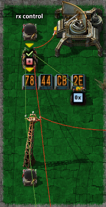
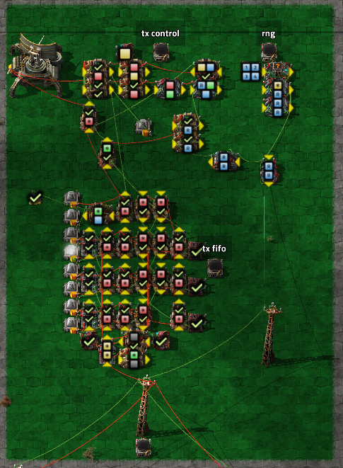
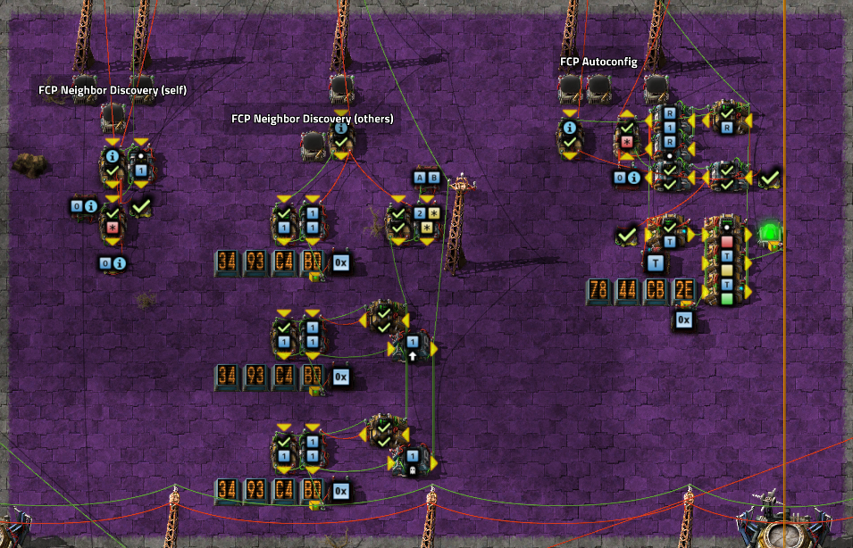
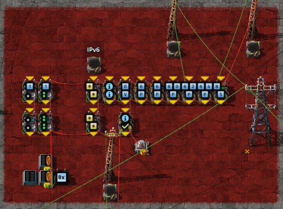
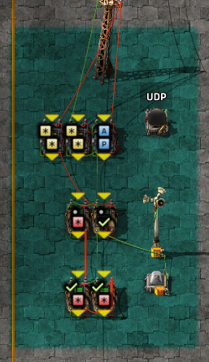


# Feathernet: Autoconfigured Native and IPv6 Networking over Factorio Circuit Networks

Feathernet is a protocol (and implementation) for transmitting packet based data (native Factorio signals, or IP packets) between many nodes over a single shared wire.

## Packet Structure

|  Signal      | Fields                    | Notes       |
|--------------|---------------------------|-------------|
| signal-check | Collision Detection       | always=1    |
| signal-dot   | Destination Address       | 0=Broadcast |
| signal-info  | Protocol Type             |             |

The primary Feathernet header is located on `signal-check`, `signal-dot`, and `signal-info`, in order to leave free as many signals as possible for raw-signal mode. Specifically, These were chosen to avoid vanilla color and alphanumeric signals to allow for lamp and display panel based display messages, as well as avoiding item and fluid signals to allow transmission of logistic network reports or requests without the need for additional filtering or transformation.

Collision detection is achieved by the use of a canary signal on `signal-check`. This signal MUST be set to 1 on all transmitted messages. A receiving node MUST discard any messages received with values other than 1, or report them to higher layers as errors.

If a collision is detected while transmitting, the transmitting node MAY choose to retransmit the frame, but it MUST wait a delay period first. This delay MUST vary and SHOULD increase on subsequent retries.

All nodes MUST listen for packets addressed to the Broadcast address, `0`. In addition, nodes may selectively listen for packets sent to one or more specific addresses, either manually or automaticaly configured.

To allow higher layer protocols to support varied packet structures (reasonably large byte-stream packets, virtual signal messages, and full item lists), multiple framing styles can be defined, selected by the Protocol Type field.

| Protocol Type | Protocol               |
|---------------|------------------------|
|             0 | raw signals            |
|             1 | IPv6 on vanilla signals|
|             2 | Feathernet Control     |
|           3-5 | Signal Map Transfer    |

## Feathernet Control

Feathernet Control Protocol provides link-layer configuration services, including auto-addressing and neighbor discovery.

|  Signal      | Fields                    |
|--------------|---------------------------|
| signal-0     | Message Type              |
| signal-1 ... | Data                      |

| Message Type |                           |
|--------------|---------------------------|
| 1            | Neighbor Solicit          |
| 2            | Neighbor Advertise        |

When a node comes up without an address, it MAY select one automatically. To do this, the node takes a random number as a candidate address, and broadcasts a Neighbor Solicit for that address. If no node answers within 180 ticks, the node broadcasts a Neighbor Advertise itself. If the node receives a Neighbor Advertise in response to the Solicit, it selects a new candidate address and starts again.

When any node receives a Neighbor Solicit for it's own address, it MUST respond with a Neighbor Advertise. Bridging and routing nodes may also respond to a Solicit for 0/Broadcast.

For Neighbor Solicit the data is the subject node address:

|  Signal      | Fields                    |
|--------------|---------------------------|
| signal-0     | Message Type = 1          |
| signal-1     | Subject Address           |

For Neighbor Advertise, the data is the subject node address, and some node information:

|  Signal      | Fields                    |
|--------------|---------------------------|
| signal-0     | Message Type = 2          |
| signal-1     | Subject Address           |
| signal-2     | Flags                     |

Flags:

0x00000001 Router
0x00000002 Supports Signal Map Transfer

A Router node will forward frames to other known links, including external networks.

## Signal Map Transfer

To support protocols that require an ordered stream of data (such as IP), an ordered map of the signals must be shared among devices. A node that supports Map Transfer should indicate this capability in FCP Advertise messages. A host may broadcast FCP Solicit to find such nodes.

### Map Request

|  Signal      | Fields                     |
|--------------|----------------------------|
| signal-info  | Protocol ID = 3            |
| entity/entity-ghost | Requester's address |
| entity/item-request-proxy  | Map ID       |

This should be sent unicast to a host that has previously advertised the capability.

### Map Transfer

|  Signal      | Fields                    |
|--------------|---------------------------|
| signal-info  | Protocol ID = 4           |
| entity/item-request-proxy  | Map ID      |

All signals not reserved by this header or the Feathernet header contain their own index (+1 to prevent the zeroth signal from being dropped) in the map.

### Extended Map Transfer

|  Signal      | Fields                    |
|--------------|---------------------------|
| signal-info  | Protocol ID = 5           |
| entity/item-request-proxy  | Map ID      |
| index 0      | Index for (collision)     |
| index 1      | Index for (protocol)      |
| index 2      | Index for (dest address)  |
| index 3      | Index for (MapID)         |

If a map provider wishes to include indexes for the reserved header signals, they can be provided as a second message, using the indexes in the first.

## IPv6

IPv6 structure is as described in RFC8200 (prev RFC2460), with an example header here (assuming no options) for reference using the reference implemention's signal map. Signals are assembled big-endian from bytes on the wire - the first byte to come in off the wire is the highest byte of the signal. The last signal will be padded with 0s in the low bytes if required to make a full 32bit word.

|   signal | Header Fields                  | Notes            |
|----------|--------------------------------|------------------|
| signal-0 | version:trafficclass:flowlabel | const 0x60000000 = 1610612736 |
| signal-1 | payloadlength:nexthead:hoplim  | `nexthead = (signal & 0xff00) >> 8` `payloadlength = (signal >> 16) & 0xffff` |
| signal-2 | source address                 | High             |
| signal-3 | source address                 | Middle High      |
| signal-4 | source address                 | Middle Low       |
| signal-5 | source address                 | Low              |
| signal-6 | destination address            | High             |
| signal-7 | destination address            | Middle High      |
| signal-8 | destination address            | Middle Low       |
| signal-9 | destination address            | Low              |

Nodes MUST configure an address in fe80::/64. Nodes MAY also configure addresses under prefixes advertised on the link by routers, or added via manual configuration.

### ICMPv6

ICMPv6 and NDP are defined in RFC4443 and RFC4861, with example headers provided here (assuming no IPv6 options) for reference.

|  signal  | Fields |
|----------|---------------|
| signal-A | type:code:checksum |
| signal-B | Data |

#### Ping/Pong

|  signal  | Fields |
|----------|---------------|
| signal-A | type:code:checksum |
| signal-B | identifier:sequence |
|   ...    | payload |

#### Route Advertisement

|  signal  | Fields |
|----------|---------------|
| signal-A | type:code:checksum |
| signal-B | hoplim8:flags8:routerlifetime16 |
| signal-C | reachabletime |
| signal-D | retranstime |
| signal-E | options... |
|   ...    | options... |

| offset | Fields |
|--------|------------------|
|    0   | type:length:data |
|    1   | data |
|   ...  | data ... |

Length is in pairs of signals (8 bytes)

* source link layer
  * type = 1
  * openwrt puts useless info in this for gre-over-v6 tunnel (top 6 bytes of outer address), so ignore it?
* prefix information
  * type = 3
  * 0 = type:length:prefixlen8:L1:A1:reserved
  * 1 = valid lifetime : seconds prefix is valid for
  * 2 = preferred lifetime : seconds prefix is preferred for
  * 3 = reserved
  * 4-7 = prefix data
* DNS Server
  * type = 25
  * 0 = type:length:reserved
  * 1 = lifetime (seconds)
  * 2-5 = address

### UDP

UDP is defined in RFC768, with an example header provided here (assuming no IPv6 options) for reference.

|  signal  | Fields |
|----------|---------------|
| signal-A | source port : destination port |
| signal-B | length : checksum |
| signal-C | data |
|    ...   | data... |

### Signal List Format

Due to the number of signals taken up by protocol headers, it is impractical to use raw signals beyond link-local scope. To facilitate such signalling on wider scales, a Signal List format is defined, to allow embedding arbitrary signals at arbitrary locations in the packet. Signal List may be used as a payload in any protocol that supports binary payload data, such as UDP.

| offset | Fields |
|--------|------------------|
|    0   | type:count:signalID|
|    1   | data |
|   ...  | data ... |

A Signal List is composed of a single header signal, followed by one or more signal values. The header signal contains three fields:

* `type`: 8 bit type
  * 0x00: signal values
    * zero count indicates end of list-of-lists
  * 0x01: Map ID
    * count=0, signalID=MapID for subsequent lists
* `count`: 8 bit count of sequential data signals
* `signalID`: 16 bit signal ID from signal map

To support non-sequential signals, an application may also use a list of Signal Lists, simply placing them one after another. Due to the `type` and `count` fields, a valid Signal List header will always be non-zero, allowing easy identification of the end of a list-of-lists.

## Implementation

### FeatherBridge

Circuit communication outside of factorio is acheived through FeatherBridge, with a mod participating in the circuit network and an external bridge communicating with it via RCON to forward packets to/from a local router over GRE.

Inside Factorio, the FeatherBridge combinator is simply connected to the main link wire, and each will act as a switch port on the bridge. The bridge will randomly select an address, which may be discovered by FCP Neighbor Discovery.

FeatherBridge supports receiving and re-sharing a prepared signal map of 375 signals (1500 bytes) via Signal Map Transfer, which will be used when translating ordered data packets to/from external networks. FeatherBridge ignores (and does not send) the Extended Map message with header signal indexes, and only supports a single map (mapid=0), but other devices on the network may use other maps for non-IP traffic or for Signal List messages over IP.

TODO: the list machine, list order choices etc...
TODO: replace GRE tunnel with requesting a subnet by DHCP-PD?

### Factorio - Feathernet Link Layer

#### Receiver

 TODO new screenshots for everything

The Feathernet receiver is simply a filter checking for collision detect=1 and destination equal to broadcast or the node's own address. Received packets are sent to higher layer protocols as they come in.

#### Transmitter

TODO: new priority queue

The Feathernet Tramsitter manages sending packets out onto the bus. Incoming packets (from higher layer circuits) are queued in a small FIFO memory, and transmitted by the collision-detection state machine. The Transmitter also contains the RNG, which is provided as an output for other modules to use as required. The Status line will have signal-blue set while the Transmitter is holding a packet which has not yet been transmitted.

##### RNG

TODO: LCG is gone. is the new random selector/shifter worth describing?

### Factorio - Protocol Layers

#### FCP Module

FCP allows nodes to self-configure unique addresses. For non-IP networks, the link layer and FCP modules are sufficient to provide basic networking, using Native Signals framing or other framing specified elsewhere.

Autoconfiguration must be triggered manually once the circuits have been constructed by pressing the Start AutoConf button. The module will then perform FCP autoconfig as described above, and provide the selected address to the receiver. Additionally, the FCP module provides red(unconfigured)/yellow(autoconf in progress)/green(autoconf completed) signals on the status line to indicate address selection state.

#### IPv6 Module

The current IPv6 node supports recieving packets with up to five addresses: The link-local address, formed by fe80::/64 and the 32bit node identifier, The all-nodes broadcast address ff02::1, and up to three globally routable unicast addresses, formed by 64-96bit prefixes combined with the node identifier in the low 32 bits. Packets matching one of these addresses are forwarded to higher layer protocols, with white=NextHeader and grey=PayloadSize. TODO: are these meta signals still right? where is matched-address (A?)?

|  Signal  | Configuation Value |
|----------|--------------------|
| signal-0 | Prefix             |
| signal-1 | Prefix             |
| signal-2 | Prefix             |
| signal-P | Prefix Length      |
| signal-T | Prefix Valid Time (ticks) |
| signal-R | Router Link-Layer Address |
| signal-H | Hop Limit          |

#### ICMP Module

The current node supports ICMP Echo Request/Reply message, and will emit Replies to any received Requests. It also listens for Route Advertisements and will auto-configure global prefixes when received.

#### UDP Module

UDP ports can be connected to various devices taking circuit inputs. For demonstration purposes, I have connected a small graphical display and a small music player.

##### Text Display

TODO

##### Graphical Display

TODO: update this demo? maybe a ppm now too?

The graphical display takes images in a headerless [pbm](http://netpbm.sourceforge.net/doc/pbm.html). Small images (32 * 38 - height could be increased to by configuring additional rows of lamps) can be sent with a command such as `convert image.png pbm:-|cut -d$'\n' -f 3 | nc -6uvv  2001:DB8::cc9:dd27 1234`, with appropriate address/port.

##### Music Player

TODO: update this demo. maybe hook up the miditorio machine to play real midis?

The music player takes a series of 32bit words each containing 5 consecutive 6 bit notes to play.

| Reserved | Note1 | Note2 | Note3 | Note4 | Note5 |
|----------|-------|-------|-------|-------|-------|
| two high bits always 00 | six bits 0-64 | six bits 0-64 | six bits 0-64 | six bits 0-64 | six bits 0-64 |

For each incoming packet, the payload data is played sequentially, one note every other tick, starting with the high-order note in each signal and advancing to the next signal after the lower-order note. After the last signal in a packet, the next buffered packet is played immediately. The note values are sent to a programmable speaker set to Piano, pitch is value.
