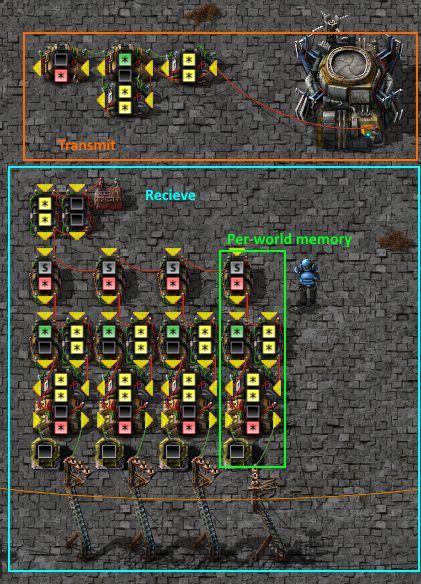

# Clusterio Combinators
Clusterio provides various combinators for connecting circuits between worlds and to the cluster itself.

### Inventory Combinator

  * Provides signals reporting inventory status of the cluster's storage, similar to roboport inventory reports.
  * Provides `signal-unixtime` with a real time signal. This can be used to monitor UPS and connectivity.
  * Provides `signal-localid` indicating this world's ID within the cluster.

### Transmit Combinator

  Transmitters are used to send data pulses or 'frames' into the cluster. Each tick, the output of all active Transmitters (those with conditions that are currently satisfied) are collected, as if on one wire together and sent to the cluster. The collected frame is automatically tagged with `signal-srcid` indicating the world it came from, and `signal-srctick` indicating the game tick (to allow reordering if required). Outgoing frames may be tagged before transmission with `signal-dstid` to send them only to a specific world.

### Recieve Combinator

  Recievers are used to listen for frames being transmitted. Incoming frames are queued up and replayed one per tick on all Recievers.

## Example circuits

### Basic inventory reporting

  The following small circuits can be used to monitor a single status frame per world. The transmitter is configured to monitor a roboport's inventory and transmit updates whenever the frame changes. The receiver sorts incoming frames to one of the memory cells by its `signal-srcid`, and stores the last received frame. Stored frames are output on the poles at the bottom, for display/processing. Pushbuttons are included to clear each memory cell manually if required.

  

  `0eNrtm11u2zgQx69S8HFXLkRSnwZ2X9ob9LEIBNmmY6L6AkUFNQIdoLfYs+1JlrJSR7FEeah0GwXWSxBZFjWc3/yHww8/ok1SsULwTKL1I+LbPCvR+usjKvl9FifNZ/JYMLRGXLIUWSiL0+Zqx7Z8x8Rqm6cbnsUyF6i2EM927Dta49q62oDIN3mRC9l5jNR3FmKZ5JKz1ojTxTHKqnTDhGr3/HRRye6rLVTkpXosz5r3qaZW7kfXQkf1j6/a33HBtu1dz0Kqi1LkSbRhh/iBq6fVI0/didS93amdsvl0z0Upo15HHriQlfrkbE37jdUmibffmv40TpRx41G7uUiLWJzMXKN/f/yjHssrqToAb5g9MHGUB57dt60XR2VolcloL/I04plqDK2lqFjdvjxre3vqA27+3AvGsq5H+U65W32Xi23FZXtZ39V1A+7C6WSMed/x9A0cH2dd7/xa33egDrp9Hyel1u+C7S69Tl96HXc83ly7l7eVJAbp0T49CxEtbGz0Wl0s0LN3YsHlIWWSb8fDAZuFw3Ozr4sIFm8PDbSSNc1Ez0GxUo7IC6Zi4mQG+mOKHE+NGzAn4853rrDrPT4Mx+nn1h6Pszq9j249jODnq9J8x6J8H3W8Zb8izIdtdo0D6rkH8wgo+2U8/fkm8WQUPzpxe8YsvJYEOcVSh4VzQyx8LYvrXyYXiSCEicY3BuW+Dajz2Pm/pOGn1g1YeeN5OBhl58FUFJzNvGdXalSnpUI1iZiXUfPdtsB4TTwOmRmaVXVPSreBAfRLqrpSqEZelnSrIPSpS11yUdr99RZFNSRGXgYYtk2SBQaOoU2rJiydmbCkFFPseY49U5jheLbA2AimA4SJzWCSecAMfAe7XjBTkn3dXaAkRig9IEqzmbM9D5KhQum5eK4kzUQXAEnRKaMh/p2kYEscf89ggSO8Mga6JgQJhlVd2JkyBi4EQemyh9BozkOA00/sTpzW4Fuefg4ViXA5aROiN6UKWeQEGrN6cgqNEFKgnMxXCegip6EyHZ7atHIKJlSCi5qGCZFxNRGjOTZxgGoKzXc+FjUNzZTgmU2nJmKbslhQDE6F4LLQosDmNdvT/g293e0b7Gr3bgEVXi/hAZcjCJm813bLrHwjVs4VVsAFCTJ9o/2WWYVGrK4s1lMbyMoxZWUvqIhthCq4ggpYhxO3c4CsPGwqKVWXdet7F9UCGcaz54lkQnNmDlAUVw0C3Dk6d2dBdv6GN/qhQ4Hh9P7nmO2APPK7ztLNZU2aYLMBmmjPdBF3vCrzwIfDqI68D1OA814VAB1gg2mnGhcFwJZ4x8ueEQX44woIwApwdORDmALIO1UAtGyhhqcG8KKAMQVQs2JyRAHhqAIG8OoU4OrIY5AC7PcqAGAxSA2355f4Hzvue20EcKDxT8dXpgbo6hrydOCfJ9cp2/EqXbFEdVGoWVuRJ0y7zxi8phTXnqh3TI2hE4wJgMa4psZgc2MGUuGwMZ6hMVNsGdybbpJP81uldee3URZK4g1T8kKfkqpUyY7nH77wtEjYh88szdV9paqynccHPiFOiGlI6/o/EyRdqw==`

### Bridged Feathernet

  A more advanced reporting system, with multiple reporting stations per world, can be configured using [Feathernet]. The following circuit will bridge each world's local Feathernet link to the cluster.

  TODO: screenshots/blueprints

### Routed Feathernet

  With a more complex bridge packets can be selectively forwarded between worlds to reduce noise on the clusterio link.

  TODO: screenshots/blueprints
